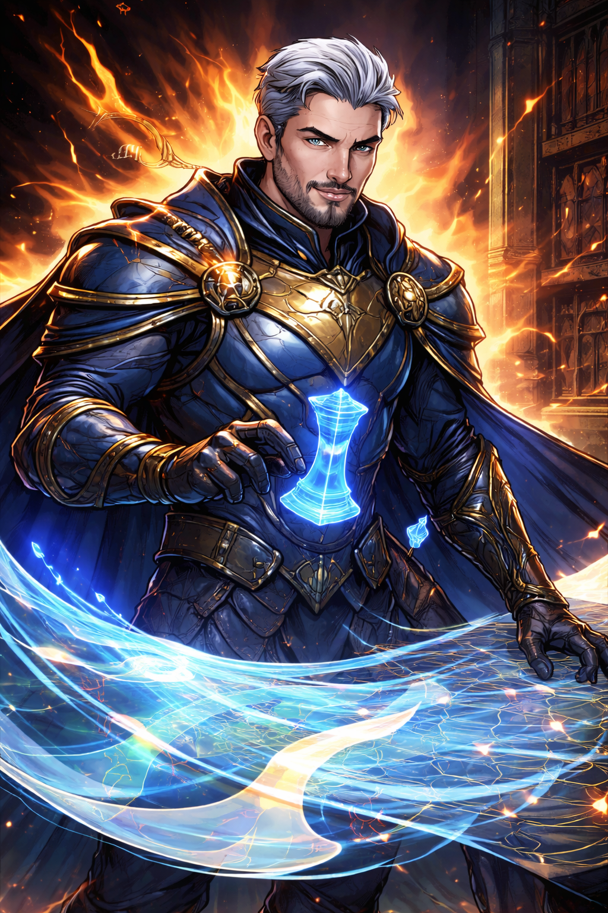

# Aurelion Vex

## Aurelion Vex — The Radiant Strategist

**Role:** Leader, tactician, battlefield controller **Likely Big Bad**

**Public Legend:** The brilliant commander who unified the Dawn and outmaneuvered the greatest villains of the age.

**True Nature:** Aurelion believes heroism without control is chaos. He saw too many “victories” lead to future disasters. When the Dawn disbanded, he didn’t retire—he recalculated.

**Current Status:** Officially missing. Secretly active, orchestrating events through intermediaries.

**Philosophy:**

“A world that needs heroes has already failed.”

**How the Party Encounters Him:**

- Early: As a distant patron, anonymous advisor, or benefactor

- Mid: As a manipulator whose plans *work too well*

- Late: As the architect of a controlled apocalypse

**Clock Impact:**

- Advances the **Revelation Clock** fastest

- Gains power when trusted blindly

## Related Pages

- [Myrrfall](../world/myrrfall.md)
- [Villains](../villains/README.md)
- [The Fallen Dawn](fallen-dawn.md)
- [Seraphine Emberfall](seraphine-emberfall.md)
- [Thorne Bramblecloak](thorne-bramblecloak.md)
- [Maelis Quill](maelis-quill.md)
- [Elyndra Vale](elyndra-vale.md)
