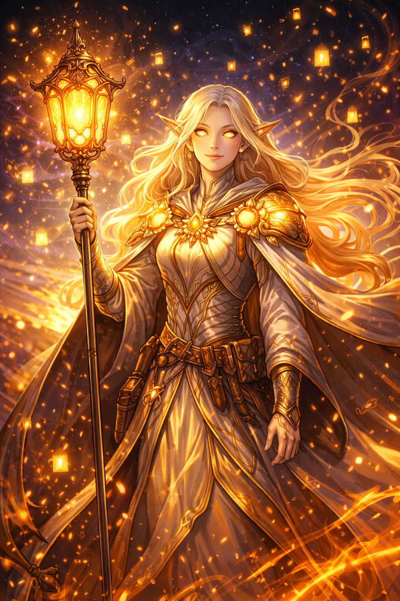

# Elyndra Vale

## Elyndra Vale — The Last Light

**Role:** Healer, historian, moral compass

**Public Legend:** The heart of the Dawn, who kept them united.

**True Nature:** She knows Aurelion’s plan—and believes it *might* be necessary. Her hesitation is what allows it to continue.

**Current Status:** Head Archivist of Luminara, mentor figure to the party.

**Philosophy:**

“If the truth destroys hope, is it still righteous?”

**How the Party Encounters Her:**

- As guide and quest-giver

- Later: As someone who has been lying by omission

**Clock Impact:**

- Controls access to Revelation

- Her choices determine how early the truth is revealed

## Related Pages

- [The Fallen Dawn](fallen-dawn.md)
- [Aurelion Vex](aurelion-vex.md)
- [Seraphine Emberfall](seraphine-emberfall.md)
- [Thorne Bramblecloak](thorne-bramblecloak.md)
- [Maelis Quill](maelis-quill.md)
