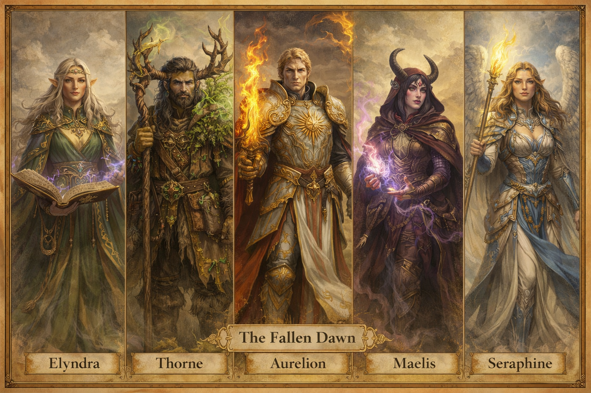

# The Fallen Dawn

The Fallen Dawn were not perfect heroes. They were *effective* ones.

They saved the world once—and every one of them paid a price for it. The party will eventually learn that the Dawn didn’t fall because they failed… but because they **could not agree on what saving the world actually meant**.

This group is intentionally designed so that:

- Each hero can be found, interacted with, or opposed

- Each embodies a philosophy about heroism

- Any one of them *could* plausibly be the final antagonist—though one is most likely

## Why the Dawn Fell Apart

They disagreed on one question:

*Who decides what the world should be saved from?*

Aurelion chose **control**. Seraphine chose **restraint**. Thorne chose **withdrawal**. Maelis chose **survival**. Elyndra chose **hope through silence**.

### DM Guidance

- Let players like some of these heroes

- Let them hate others

- Let them be right either way

The tragedy of the Fallen Dawn is not betrayal.

It is conviction.

## Related Pages

- [Myrrfall](../world/myrrfall.md)
- [Aurelion Vex](aurelion-vex.md)
- [Seraphine Emberfall](seraphine-emberfall.md)
- [Thorne Bramblecloak](thorne-bramblecloak.md)
- [Maelis Quill](maelis-quill.md)
- [Elyndra Vale](elyndra-vale.md)
