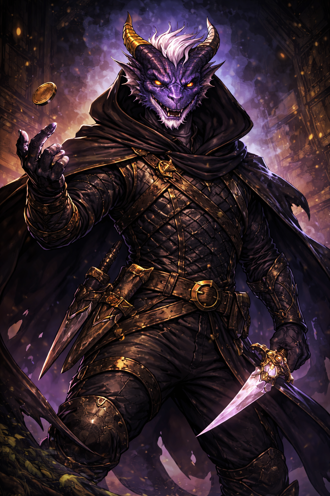

# Maelis Quill

## Maelis Quill — The Laughing Shadow

**Role:** Rogue, spy, infiltration

**Public Legend:** The hero who always smiled and always escaped.

**True Nature:** Maelis never believed the Dawn could win forever. He prepared escape routes, backups, and contingencies—some of which now empower villains.

**Current Status:** Presumed dead. Actually operating within Luminara’s Gilded Below.

**Philosophy:**

“Survival is the only real victory.”

**How the Party Encounters Him:**

- As a rival operative

- As a morally flexible informant

**Clock Impact:**

- Can slow clocks temporarily

- Increases moral ambiguity and distrust

## Related Pages

- [The Fallen Dawn](fallen-dawn.md)
- [Aurelion Vex](aurelion-vex.md)
- [Seraphine Emberfall](seraphine-emberfall.md)
- [Thorne Bramblecloak](thorne-bramblecloak.md)
- [Elyndra Vale](elyndra-vale.md)
