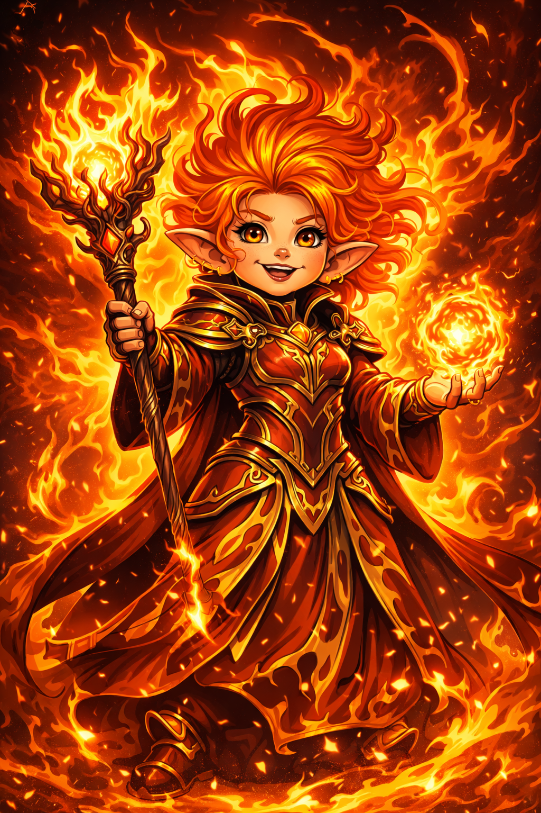

# Seraphine Emberfall

## Seraphine Emberfall — The Living Inferno

**Role:** Magical artillery, destructive force

**Public Legend:** The sorcerer who burned entire armies to ash.

**True Nature:** She fears her own power. After one victory killed thousands unintentionally, she exiled herself rather than risk becoming a monster.

**Current Status:** Living alone in the Prism Expanse, suppressing her magic.

**Philosophy:**

“Some weapons should never be drawn twice.”

**How the Party Encounters Her:**

- As a reluctant ally

- As a living natural disaster if provoked

**Clock Impact:**

- Can reverse Resurgence Clock segments

- But risks advancing the Legacy Clock toward fracture

## Related Pages

- [Myrrfall](../world/myrrfall.md)
- [The Prism Expanse](../world/prism-expanse.md)
- [The Fallen Dawn](fallen-dawn.md)
- [Aurelion Vex](aurelion-vex.md)
- [Thorne Bramblecloak](thorne-bramblecloak.md)
- [Maelis Quill](maelis-quill.md)
- [Elyndra Vale](elyndra-vale.md)
