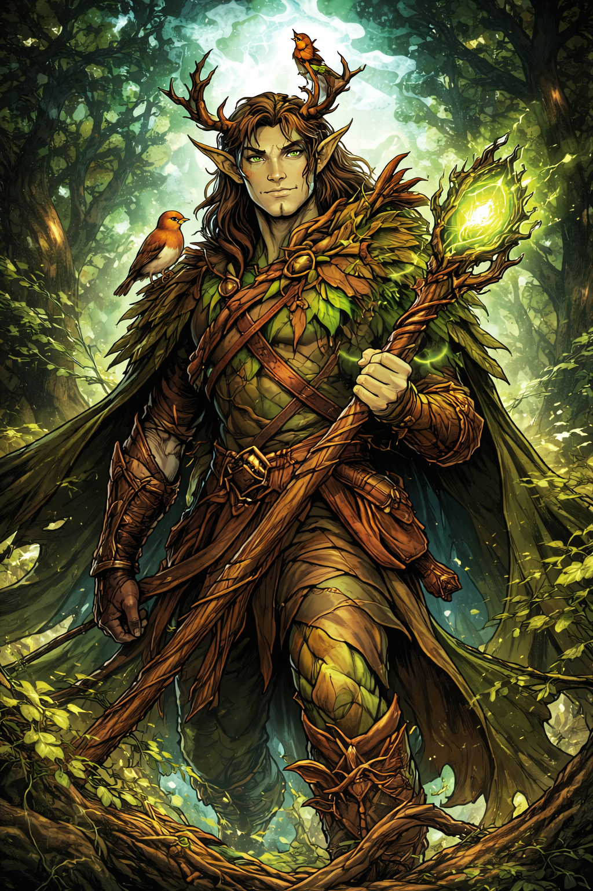

# Thorne Bramblecloak

## Thorne Bramblecloak — The Verdant Warden

**Role:** Defender, battlefield control, nature magic

**Public Legend:** Protector of cities and wilds alike.

**True Nature:** He sided with nature over civilization after witnessing repeated destruction. Now protects the world *from people*.

**Current Status:** Merged with the Verdant Rise, no longer fully mortal.

**Philosophy:**

“The world survived before us. It will survive after us.”

**How the Party Encounters Him:**

- As an environmental obstacle

- As a potential uneasy ally

**Clock Impact:**

- Stabilizes regions but at social cost

- Advances Resurgence indirectly if opposed

## Related Pages

- [Myrrfall](../world/myrrfall.md)
- [The Fallen Dawn](fallen-dawn.md)
- [Aurelion Vex](aurelion-vex.md)
- [Seraphine Emberfall](seraphine-emberfall.md)
- [Maelis Quill](maelis-quill.md)
- [Elyndra Vale](elyndra-vale.md)
