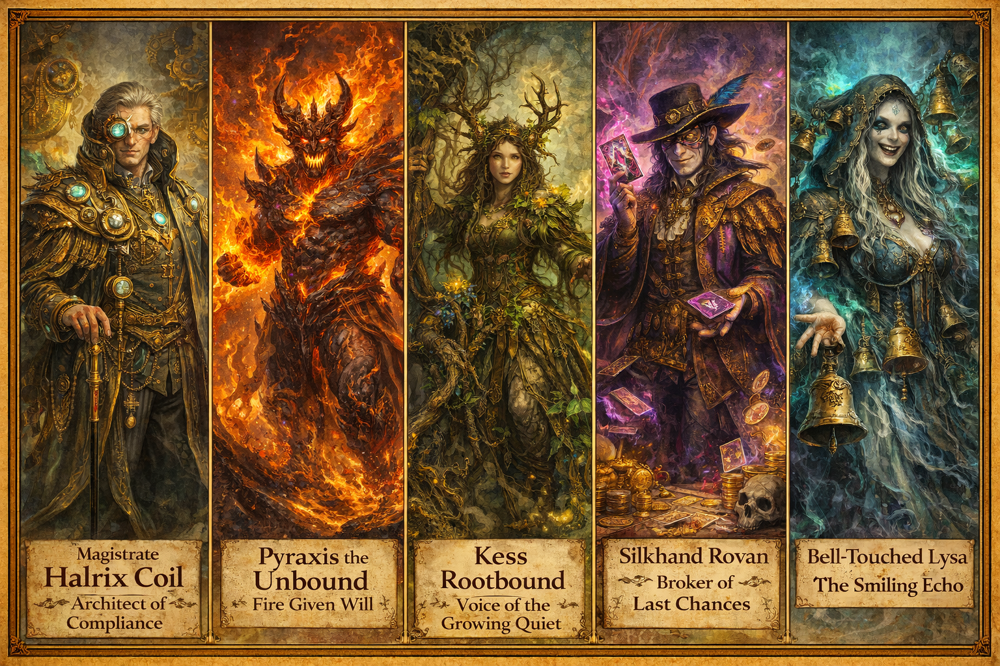

# Villains

## The Villains of Echoes of the Fallen Dawn

The villains of this campaign are not random evils. They are **responses**—to heroes, to failure, and to a world that survived but did not heal.

Each major villain faction mirrors a philosophy of the Fallen Dawn and advances the **Resurgence Clock** in a distinct way. They can be confronted in any order.

### Major Villain Factions

#### 1. [The Concord of the Final Shape](../factions/concord-of-the-final-shape.md)

#### 2. [The Ashen Remnant](../factions/ashen-remnant.md)

#### 3. [The Verdant Silence](../factions/verdant-silence.md)

#### 4. [The Gilded Knives](../factions/gilded-knives.md)

#### 5. [The Shattered Tome](../factions/shattered-tome.md)

### Minor & Emergent Villains

Use these when the party creates new problems:

- A Concord magistrate who refuses to relinquish power

- A rogue Ashen cultist seeking to outdo Kael

- A Verdant beast awakened prematurely

- A Gilded Knife selling party secrets

### Villains & the Fallen Dawn (Mirrors)

| Villain Faction | Mirrors Which Hero |
| --- | --- |
| Concord of the Final Shape | Aurelion Vex |
| Ashen Remnant | Seraphine Emberfall |
| Verdant Silence | Thorne Bramblecloak |
| Gilded Knives | Maelis Quill |
| Choir of the Drowned Laugh | Elyndra Vale |

### DM Guidance

- Villains should feel *right* in their environment

- Let factions clash without the party

- Show villains improving, adapting, learning

The world does not spiral into chaos.

It is being **reshaped**—piece by piece.

### Using Lieutenants at the Table

- Let them retreat; survival is not failure

- Give them recognizable tells or motifs

- Track their personal progress alongside clocks

If the players remember their names, they’re doing their job.

## Related Pages

- [Myrrfall](../world/myrrfall.md)
- [The Fallen Dawn](../heroes/fallen-dawn.md)
- [Aurelion Vex](../heroes/aurelion-vex.md)
- [Seraphine Emberfall](../heroes/seraphine-emberfall.md)
- [Thorne Bramblecloak](../heroes/thorne-bramblecloak.md)
- [Maelis Quill](../heroes/maelis-quill.md)
- [Elyndra Vale](../heroes/elyndra-vale.md)
- [The Concord of the Final Shape](../factions/concord-of-the-final-shape.md)
- [Magistrate Halrix Coil](magistrate-halrix-coil.md)
- [The Ashen Remnant](../factions/ashen-remnant.md)
- [Pyraxis the Unbound](pyraxis-the-unbound.md)
- [The Verdant Silence](../factions/verdant-silence.md)
