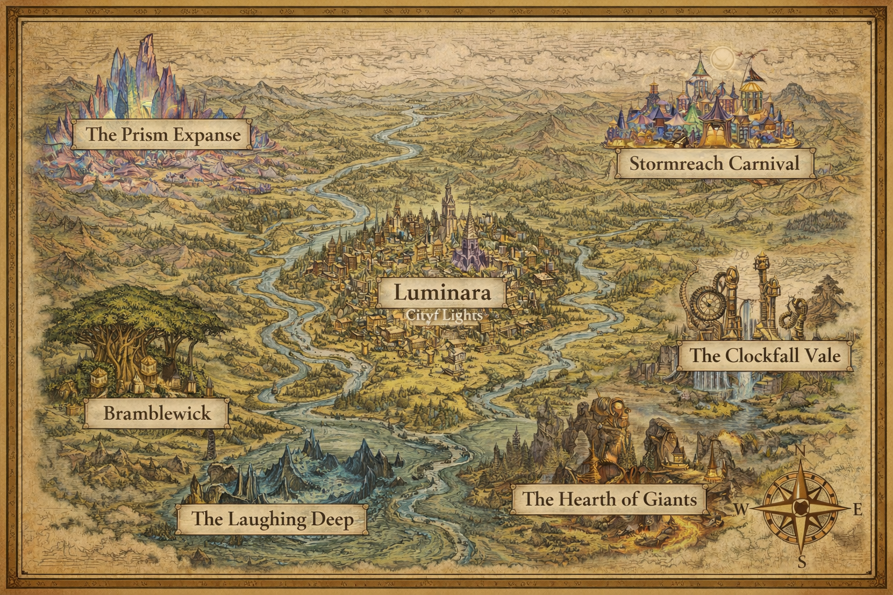

# Myrrfall

This world is vibrant, strange, and full of wonder—but it is not naive.

Magic left its fingerprints everywhere during the age of the Fallen Dawn. What remains is not ruin, but **eccentricity**: places shaped by half-forgotten miracles, imperfect victories, and magic that never fully went away.

## Related Pages

- [The Fallen Dawn](../heroes/fallen-dawn.md)
- [The Prism Expanse](prism-expanse.md)
- [Stormreach Carnival](../locations/stormreach-carnival.md)
- [Luminara](../locations/luminara.md)
- [The Laughing Deep](../locations/laughing-deep.md)
- [The Clockfall Vale](../locations/clockfall-vale.md)
- [Bramblewick](../locations/bramblewick.md)
- [The Hearth of Giants](../locations/hearth-of-giants.md)
