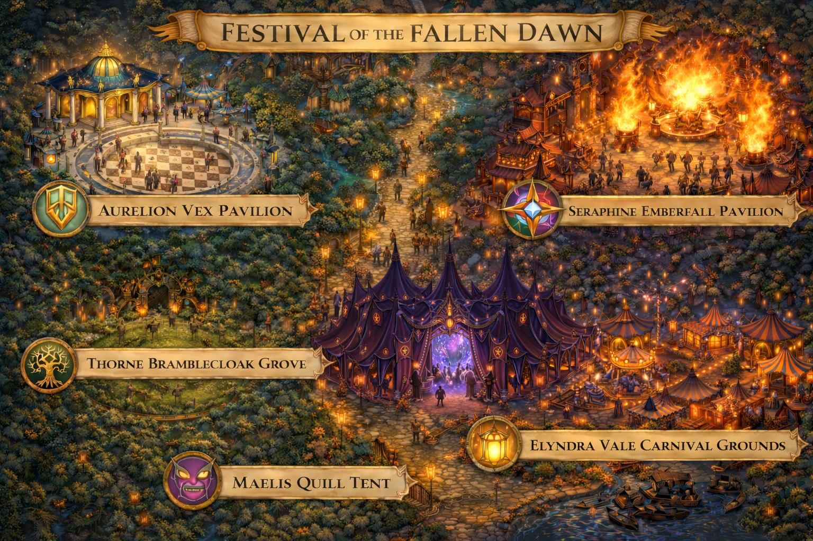
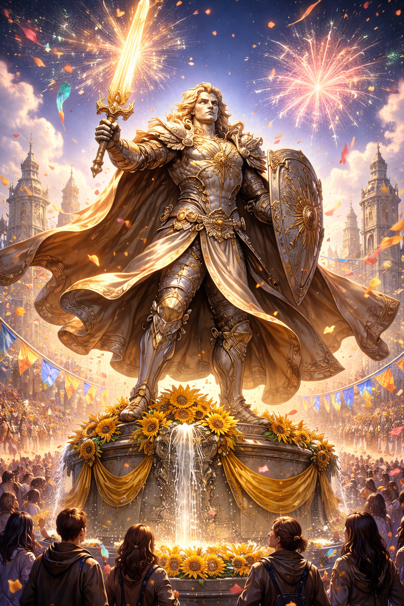
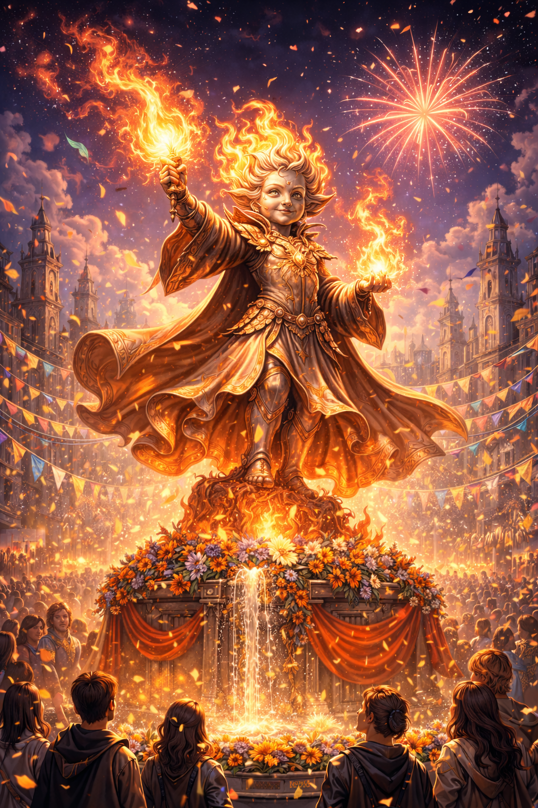
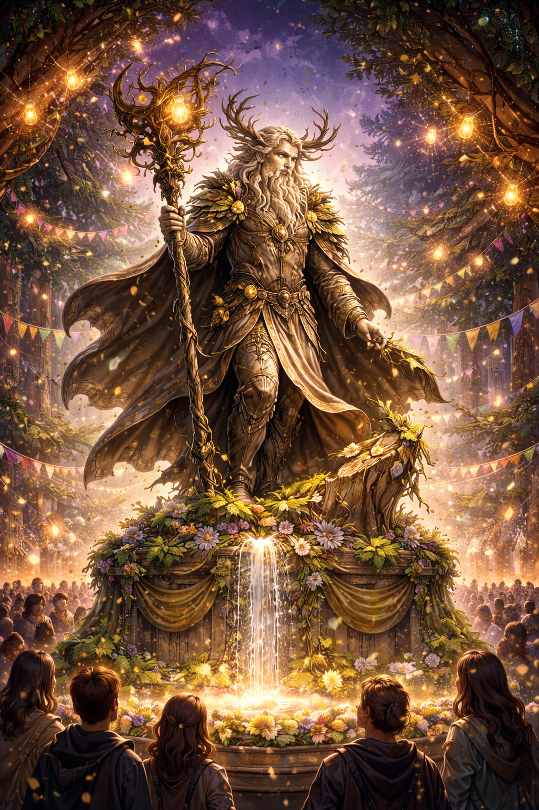
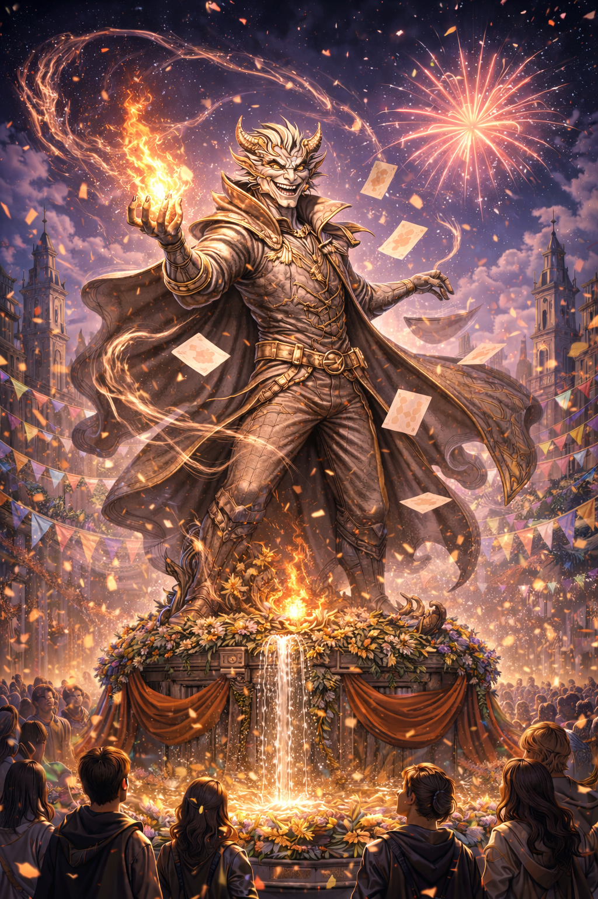
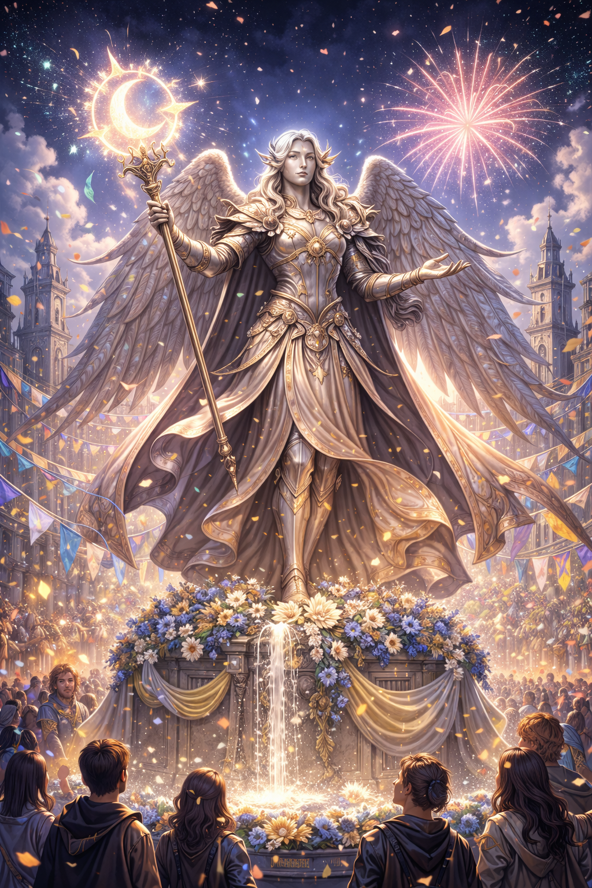

# Festival Layout

### Zone 1 — Aurelion Vex Pavilion

- Theme: Strategy and intellect

- Attractions: Puzzle contests, mock debates, riddles, simulated “heroic civic challenges”

- Flavor: Maps and statues show “Aurelion’s great deeds”; actors re-enact famous moments

- Player takeaway: Aurelion is calculating, patient, and visionary

- Skills: Intelligence (puzzle-solving), Insight (detecting deception), Persuasion (debate challenges)

You step into a wide plaza filled with tables, statues, and giant puzzle boards. Actors dressed in formal robes re-enact scenes of clever deeds: moving pieces across maps, balancing scales of law, negotiating mock treaties. Children dart between tables, racing to solve riddles before their friends.

A large holographic display simulates a city in chaos, and visitors can try to stabilize it with their decisions. You feel a subtle hum of order and calculation in the air, as if the pavilion itself encourages cleverness and foresight. Whispers tell of Aurelion’s legendary patience and intellect; even in stories, he seems to see ten steps ahead.

#### Carnival Games / Skill Checks:

- **Puzzle Race:** Intelligence check to solve a mini puzzle faster than NPCs - DC 13

- **Debate Duel:** Persuasion or Insight check to win a mock debate - DC 12

- **Codebreaker Booth:** Investigation or Arcana check to decipher Aurelion’s secret message - DC 14

#### Ticket master

**Name:** Magistrix Bellora Harth **Role:** Civic Orator & Pavilion Host **Description:**  A sharp-dressed woman with silver-threaded robes and a voice trained for public squares. She carries a ceremonial ledger she occasionally taps for emphasis.

**Personality:** Proud, composed, slightly smug **Flavor Line:**

“Aurelion taught us that victory favors those who plan three moves ahead. Even today, the city stands because someone once *thought* for it.”

**Use:**

- Answers questions about hero “strategy”

- Offers a planning-based carnival game

- Subtly echoes Concord rhetoric without naming them

#### Overheard:

- “They say Aurelion once stopped a city from collapsing using only a chessboard.”

### Zone 2 — Seraphine Emberfall Pavilion

- Theme: Fire, magic, spectacle

- Attractions: Fire dancing, light shows, magical displays, minor illusion booths

- Flavor: Colorful banners, magical performances, interactive pyrotechnics (harmless to players unless they fail checks)

- Player takeaway: Seraphine is daring, vibrant, and somewhat dangerous

- Skills: Performance, Arcana, Dexterity (interactive demonstrations)

This area crackles with light and heat. Fire dancers spin in arcs of flame, and performers conjure tiny illusions that shimmer in rainbow colors. Small magical experiments sparkle in midair — sparks that vanish just before they hit the ground.

The scent of burning incense mixes with smoke and caramelized sugar. Children squeal in delight as minor magical bursts bounce unpredictably around the area. Even from a distance, you can feel the thrill of danger here — Seraphine’s influence is audacious and unrestrained, daring you to try something you might not entirely control.

#### Carnival Games / Skill Checks:

- **Fire Ring Toss:** Dexterity check to toss rings around floating flames - DC 13

- **Magic Spark Target:** Arcana check to activate harmless magical bursts in sequence - DC 14

- **Illusion Guess:** Insight check to determine which illusion is real - DC 13

#### Ticket master

**Name:** Flicker Nibsprocket **Role:** Pyrotechnic Performer & Arcane Safety Officer **Description:**  A soot-smudged gnome in oversized goggles, sparks occasionally popping from the crystal rod in her hand.

**Personality:** Excitable, brilliant, easily distracted **Flavor Line:**

“Booms are just magic expressing itself loudly! Seraphine understood that—fire isn’t destruction, it’s *expression*!”

**Use:**

- Runs spell-based or reflex games

- Foreshadows volatile magic themes

- Knows rumors of magical disturbances (very vaguely)

#### Overheard:

- “Seraphine could ignite a single candle and it would burn forever without harming a soul.”

### Zone 3 — Thorne Bramblecloak Grove

- Theme: Nature, balance, cleverness

- Attractions: Hidden paths, climbing challenges, living plant sculptures, cooperative games

- Flavor: Animatronic or minor magical animals participate, paths may shift slightly to test observation

- Player takeaway: Thorne is clever, protective, and adaptable

- Skills: Survival, Athletics, Perception

You enter a grove unlike the rest of the festival — the paths twist and shift, and tall, lush trees seem almost alive, whispering among themselves. Animal-shaped topiaries peek from unexpected corners, and gentle streams cut across hidden walkways.

Visitors climb, leap, and navigate hidden bridges, testing agility and observation. Occasionally, a squirrel or small magical creature seems to watch you, as if judging your choices. This area exudes harmony with nature, cleverness, and a quiet challenge: Thorne’s domain encourages balance, awareness, and careful thought.

#### Carnival Games / Skill Checks:

- **Tree Climb Challenge:** Athletics check to reach the top of a twisting tree structure - DC 13

- **Hidden Path Maze:** Survival or Perception check to find the correct route through the grove - DC 14

- **Animal Whisper Game:** Nature or Animal Handling check to guide animals to a target - DC 12

#### Ticket master

**Name:** Rowan Underbough **Role:** Groundskeeper & Living Maze Designer **Description:**  A calm elf with bark-textured armor and a wreath of living leaves that subtly shifts with his mood.

**Personality:** Gentle, thoughtful, quietly intense **Flavor Line:**

“Thorne listened to the world when others spoke over it. This grove is a tribute—not a prison.”

**Use:**

- Oversees nature or survival challenges

- Can comment on “balance” and “roots”

- Reacts strongly to violence in the festival

#### Overheard:

- “Thorne whispers to the trees, and the animals obey.

### Zone 4 — Maelis Quill Tent

- Theme: Mystery, chaos, truth

- Attractions: Illusions, riddles, whispering rumor games, playful pranks

- Flavor: Slightly surreal, reality seems “off” here; fortunes told, hidden truths hinted at

- Player takeaway: Maelis is mischievous, perceptive, and unpredictable

- Skills: Insight, Deception, Investigation

You step under a tent flapping with brightly patterned banners, and the world seems just a little… off. Voices echo slightly delayed, shadows flicker oddly, and distant laughter sounds almost too close. Riddles are whispered by hidden figures; illusions play tricks on your eyes.

Visitors are coaxed into games of deception and discovery — some rewarding, some revealing secrets they didn’t realize they had. It’s playful, confusing, and strangely compelling. Every corner feels like a story waiting to unfold, and the deeper you explore, the less you’re sure of what is true. Maelis’ mischievous, perceptive nature fills the air.

#### Carnival Games / Skill Checks:

- **Riddle Challenge:** Intelligence or Insight check to solve a series of whimsical riddles - DC 13

- **Illusion Spotting:** Arcana or Investigation check to find the true path among illusions - DC 14

- **Prank Contest:** Deception or Sleight of Hand check to outwit NPC pranksters - DC 12

#### Ticket master

**Name:** Jexa “Two-Smiles” **Role:** Illusionist & Trick Game Host **Description:**  A tiefling with asymmetrical horns, one painted gold. Their shadow occasionally moves a half-second out of sync.

**Personality:** Playful, unsettling, charming **Flavor Line:**

“Maelis taught us that truth is flexible—like a good punchline. Care to test your instincts?”

**Use:**

- Runs deception, insight, or sleight-of-hand games

- Drops contradictory rumors for fun

- Knows how to disappear into a crowd

#### Overheard:

- “Maelis knows your secrets before you do.”

### Zone 5 — Elyndra Vale Carnival Grounds

- Theme: Hope, guidance, inspiration

- Attractions: Rides, inspiring speeches, small interactive challenges to help NPCs, parades

- Flavor: People leave with a sense of purpose; subtle coincidences make them feel guided

- Player takeaway: Elyndra is subtle, inspiring, and quietly guiding

- Skills: Persuasion, Performance, Insight

The area bursts with movement: colorful tents, dazzling rides, and performers of every kind. Parades march through the center, small acts of kindness play out for eager crowds, and the scent of fresh-baked treats makes everyone’s stomach rumble.

Children laugh as acrobats spin overhead, and adults find themselves smiling without realizing why. Something about this place feels like it’s trying to nudge everyone forward, subtly guiding choices and offering small sparks of hope. Even without seeing Elyndra herself, her influence is felt everywhere, in every cheerful cheer, in every well-timed coincidence.

#### Carnival Games / Skill Checks:

- **Ring Toss:** Dexterity check to land rings on prize pegs - DC 12

- **Performance Challenge:** Performance or Persuasion check to impress the crowd or earn cheers - DC 13

- **Good Deed Game:** Insight or Charisma check to help NPCs in fun tasks and spread inspiration - DC 12

#### Ticket master

**Name:** Old Pellen of the Lights **Role:** Lantern Lighter & Storyteller **Description:**  A stooped elderly man who carries a long pole tipped with a glowing crystal flame. His eyes reflect light like polished glass.

**Personality:** Warm, cryptic, kind **Flavor Line:**

“Elyndra showed us the way forward—not by force, but by light. Funny thing about light… it always finds those who need it.”

**Use:**

- Tells gentle, symbolic stories

- Subtly primes the party for Elyndra’s arrival

- May recognize the PCs as “interesting”

#### Overheard:

- “Elyndra guided a lost child to the right path… without ever touching them.”

## Related Pages

- [Myrrfall](../../../lore/world/myrrfall.md)
- [Aurelion Vex](../../../lore/heroes/aurelion-vex.md)
- [Seraphine Emberfall](../../../lore/heroes/seraphine-emberfall.md)
- [Thorne Bramblecloak](../../../lore/heroes/thorne-bramblecloak.md)
- [Maelis Quill](../../../lore/heroes/maelis-quill.md)
- [Elyndra Vale](../../../lore/heroes/elyndra-vale.md)
- [Session 1: Festival of the Fallen Dawn](README.md)
- [Festival Staff](festival-staff.md)
- [Festival Plaza Combat](plaza-combat.md)
- [Prize Redemption](prizes.md)
- [Elyndra's Arrival](elyndras-arrival.md)
- [The Tests of Elyndra](tests-of-elyndra.md)
